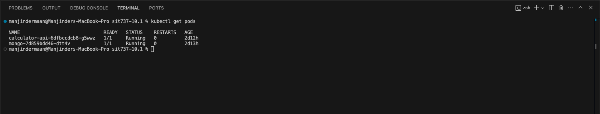
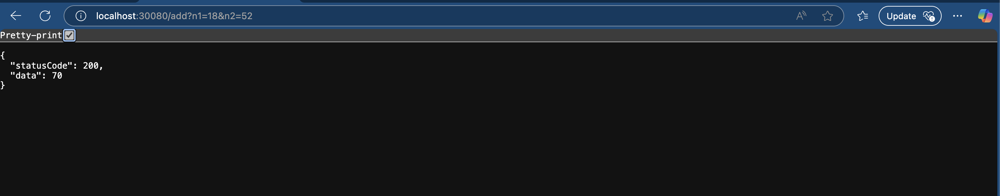

## SIT737 Task 9P – Adding a Database

## Introduction:

A basic calculator microservice serves as the demonstration project which was built using Node.js together with MongoDB and it runs on a local Kubernetes cluster that is managed by kubectl. The system uses Node.js with MongoDB connectivity running inside a Kubernetes cluster which operates locally through kubectl commands. The microservice supports basic arithmetic operations (addition and subtraction and multiplication and division) function with the request logger for MongoDB.

## Objective:

The goal was to:

1. Containerize a Node.js calculator app.
2. Deploy MongoDB as a service in the Kubernetes cluster.
3. Create a Kubernetes Secret to store the MongoDB URI securely.
4. Connect the app to MongoDB using the secret.
5. Expose the calculator API via NodePort.
6. Verify successful deployment and functionality.

## Application Overview:

The calculator microservice supports minimalist arithmetic functions which include addition. subtraction, multiplication, and division. It exposes REST endpoints that The microservice accepts numeric input through two parameters which produce JSON output results. The service logs each calculation request and its result to MongoDB for persistence.

## Tools and Technologies:

- **Node.js** – Used to build the backend for the calculator microservice.
- **MongoDB** – NoSQL database used to store calculation logs.
- **Docker** – Used to containerize the application.
- **Docker Hub** – Hosts the container images publicly.
- **Kubernetes** – Orchestrates and manages the containers.
- **kubectl** – CLI tool to interact with the Kubernetes cluster.
- **Docker Desktop** – Provides a local Kubernetes cluster for testing.

## Deployment Process:

1. **Build and push the Docker image:**

```bash
   docker build -t manjindersingh28/calculator-api:latest .
   docker push manjindersingh28/calculator-api:latest
```

2. **Apply Kubernetes configuration files:**

```bash
kubectl apply -f kubernetes/mongo-pvc.yaml
kubectl apply -f kubernetes/mongo-deployment.yaml
kubectl apply -f kubernetes/mongo-service.yaml
kubectl apply -f kubernetes/mongo-secret.yaml
kubectl apply -f kubernetes/deployment.yaml
kubectl apply -f kubernetes/service.yaml
```

3. **Restart deployment to apply updated secret and environment config:**

```bash
kubectl rollout restart deployment calculator-api
```

4. **Verify pod status and logs:**

```bash
kubectl get pods
kubectl logs deployment/calculator-api
```

5. **Test the API using a browser:**

```bash
http://localhost:30080/add?n1=10&n2=5

```

## Learning Outcome:

Understood how to use Kubernetes Secrets to securely inject runtime environment variables.

Learned service discovery in Kubernetes using internal DNS (e.g., mongo-service).

Practiced real-world container orchestration and microservice connectivity.

Gained hands-on experience with Docker image publishing and Kubernetes deployments.

## Conclusion:

Task 9.1 provided hands-on experience with building cloud-native microservices, managing runtime configurations using secrets, and handling service-to-service communication in Kubernetes. Successfully connecting the app to MongoDB and deploying it via Kubernetes simulated real-world backend infrastructure deployment workflows.

## Student Details:

Name: Manjinder Singh
Unit: SIT737 – Cloud Native Application Development
Task: 9.1P – Adding a Database

## 📸 Screenshots

### 🖥️ Terminal Output



This screenshot shows the successful deployment of both the calculator-api and MongoDB pods in Kubernetes. It also logs the incoming request and response:

MONGODB_URI is correctly injected.

Connection to MongoDB is successful.

Request to add n1=10 and n2=5 was handled properly by the microservice.

### 🌐 Browser Output



This screenshot displays the response from accessing the calculator microservice via browser at http://localhost:30080/add?n1=18&n2=52.

The service successfully processed the request.

The response JSON confirms that the addition result is 70.
