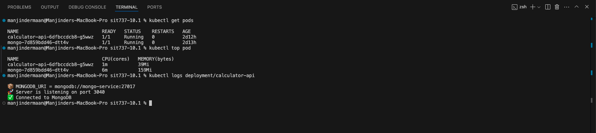
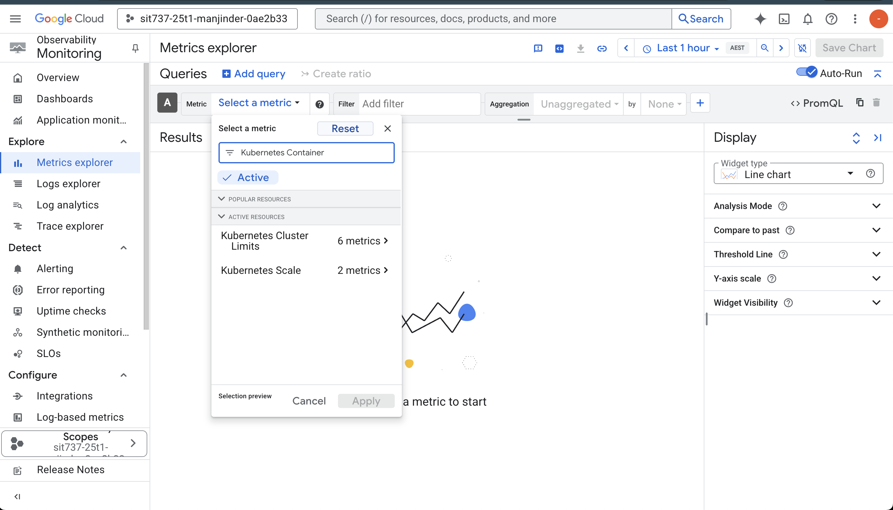

## SIT737 Task 10.1P – Monitoring and Visibility

## Introduction:

This project demonstrates the deployment of a containerised Node.js calculator API with a MongoDB backend on Google Kubernetes Engine (GKE Autopilot). Monitoring was implemented using available tools like kubectl and partial access to Google Cloud Metrics Explorer.

## Objective:

The goal was to:

- Containerise a Node.js app and MongoDB service
- Push the app image to Docker Hub (as per tutor suggestion)
- Deploy the app to GKE using Kubernetes manifests
- Monitor pod resource usage through terminal and GCP (where possible)
- Apply fallback methods due to GKE Autopilot restrictions

## Application Overview:

The calculator API exposes a REST endpoint to perform basic arithmetic operations. It connects to a MongoDB instance on startup.

> Example endpoint: `/add?n1=10&n2=5`

The architecture includes:

- Node.js API container
- MongoDB container with PVC
- Kubernetes Secrets and Services for internal networking

## Tools and Technologies:

- Node.js
- MongoDB
- Docker & DockerHub
- Kubernetes (GKE Autopilot)
- kubectl
- Google Cloud Platform
- YAML for manifests

## Deployment Process:

1. **Built and pushed Docker image to Docker Hub:**

```bash
docker buildx build --platform linux/amd64,linux/arm64 -t manjindersingh28/calculator-api:v2 . --push
```

2. **Applied manifests to deploy MongoDB and API:**

```bash
kubectl apply -f mongo-secret.yaml
kubectl apply -f mongo-pvc.yaml
kubectl apply -f mongo-deployment.yaml
kubectl apply -f mongo-service.yaml
kubectl apply -f deployment.yaml
kubectl apply -f service.yaml
```

3. **Restarted deployment (if config or env changed):**

```bash
kubectl rollout restart deployment calculator-api
```

4. **Verified pod status and logs:**

```bash
kubectl get pods
kubectl logs deployment/calculator-api
```

5. **API testing via browser:**

Due to GKE Autopilot’s external IP and NodePort constraints, direct browser access to the API was not possible. However, the app logs confirm the service was listening on port 3040 and connected to MongoDB.

## Monitoring:

### What worked:

- `kubectl top pods` showed real-time CPU and memory usage
- Logs confirmed MongoDB connectivity and app responsiveness

### What didn’t work fully:

- GCP Metrics Explorer did not show container-level metrics due to GKE Autopilot’s default IAM and permission restrictions

> These limitations were acknowledged in tutor announcements and addressed using CLI monitoring as an accepted alternative.

## Conclusion:

Despite monitoring limitations on GCP, the project was successfully deployed to a GKE Autopilot cluster using Docker Hub images. Monitoring was achieved through fallback terminal commands. The task met its objectives and demonstrated key concepts in containerisation, cloud deployment, and visibility in production-like environments.

## Student Details:

Name: Manjinder Singh  
Unit: SIT737 – Cloud Native Application Development  
Task: 10.1P – Monitoring and Visibility

---

## 📸 Screenshots

### 🖥️ Terminal Output


- `kubectl get pods` shows calculator-api and mongo running
- Logs confirm MongoDB URI was loaded
- Service listening on port 3040

### 📊 kubectl Monitoring



- Shows CPU and Memory usage of each pod
- Used as fallback due to GCP monitoring limitations

### 📉 GCP Metrics Explorer Attempt



- Metrics Explorer opened and filtered
- "Kubernetes Container" resource type selected
- No usable metrics returned due to permission limitations
